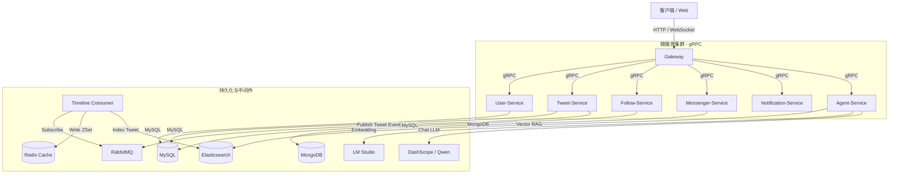

# Project Overview (项目概览与技术拓扑)

本项目是一个高并发、生产级、云原生的 Twitter 社交平台克隆版（Monorepo），支持推文发布、实时 Timeline、用户社交、私信互动、智能体（Agent）接入、RAG 知识检索等核心功能。

---

## 1. 核心技术栈

* **开发语言**：Go 1.25.5
* **核心框架**：Gin (Gateway HTTP 层)、gRPC (微服务间 RPC 通信)
* **关系型数据库**：MySQL (通过 GORM 驱动进行持久化)
* **非关系型数据库**：MongoDB (主要用于 Messenger 消息存储)
* **缓存与实时组件**：Redis (用于 Timeline 缓存、高频读取、ZSet 排行榜)
* **消息队列**：RabbitMQ (用于推文发布后的异步 Timeline 写扩散分发)
* **检索与向量引擎**：Elasticsearch (用于推文全文检索与基于 Embedding 的 RAG 向量检索)
* **AI 基础设施**：本地 LM Studio (文本嵌入 text-embedding-bge-m3)、阿里云百炼 DashScope (Qwen 大语言模型)

---

## 2. 微服务组件角色与职责

项目采用单体仓库（Monorepo）结构管理，所有微服务的入口均位于 [cmd/](file:///e:/GOProject/云原生/twitter-clone/cmd) 目录下：

* **[gateway](file:///e:/GOProject/云原生/twitter-clone/cmd/gateway)**:
  * **职责**：统一入口网关。负责接收外部 HTTP 请求，进行 JWT 鉴权、路由转发（反向代理至各 gRPC 微服务），并提供 WebSocket 长连接（用于即时通讯和通知推送）。
* **[user-service](file:///e:/GOProject/云原生/twitter-clone/cmd/user-service)**:
  * **职责**：用户服务。提供用户注册、登录、个人信息管理等核心逻辑。
* **[tweet-service](file:///e:/GOProject/云原生/twitter-clone/cmd/tweet-service)**:
  * **职责**：推文服务。处理推文（Tweet）的创建、删除、点赞、转推（Retweet）、评论以及投票（Poll）。
* **[follow-service](file:///e:/GOProject/云原生/twitter-clone/cmd/follow-service)**:
  * **职责**：关系服务。维护用户之间的关注与粉丝关系（Follow/Followers）。
* **[messenger-service](file:///e:/GOProject/云原生/twitter-clone/cmd/messenger-service)**:
  * **职责**：即时通讯服务。负责处理用户之间的单聊/私信（Message）消息的持久化与发送。
* **[notification-service](file:///e:/GOProject/云原生/twitter-clone/cmd/notification-service)**:
  * **职责**：通知服务。负责系统通知（点赞、关注、提及等）的推送。
* **[agent-service](file:///e:/GOProject/云原生/twitter-clone/cmd/agent-service)**:
  * **职责**：AI 智能体服务。集成百炼大模型与 Elasticsearch RAG，支持 MCP 协议的微服务交互，允许用户与 Twitter Agent 进行互动。
* **[consumer](file:///e:/GOProject/云原生/twitter-clone/cmd/consumer)**:
  * **职责**：消息队列消费者。订阅 RabbitMQ 中推文发布等事件，进行 Timeline 的写扩散推送，以及异步同步推文数据到 Elasticsearch。

---

## 3. 系统架构拓扑图

