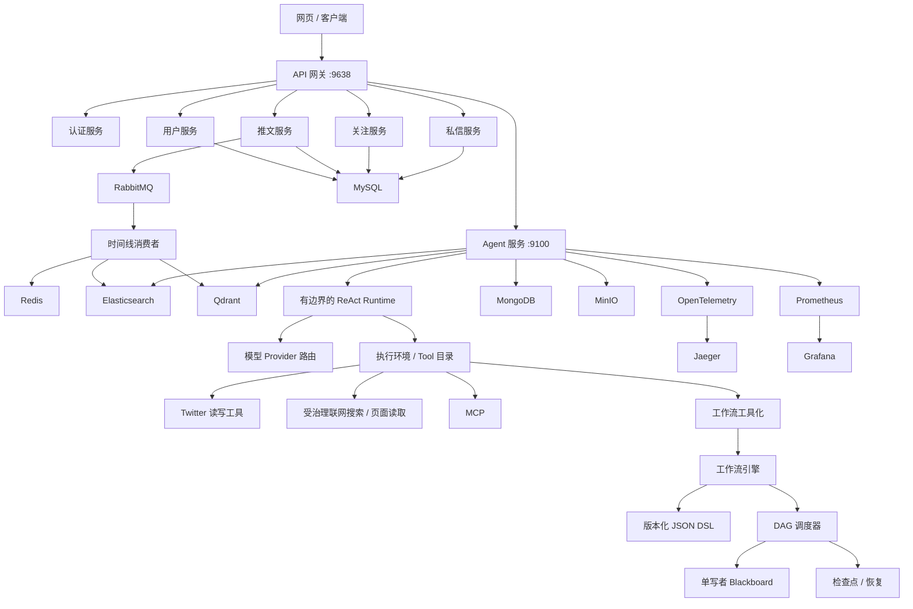

# 后端服务与 Agent 工程平台

> 一个基于 Go 的单仓库工程，融合社交内容微服务、受治理的 Agent 运行时、Tool / MCP 接入、可恢复 DAG 工作流引擎、检索基础设施与端到端可观测能力。

本仓库最初从社交平台后端出发，当前已经演进为一个同时包含 **业务微服务** 与 **Agent 基础设施** 的工程实践项目。

项目的重点不只是“调用大模型”，而是尝试回答一组更偏工程化的问题：

- Agent 如何在有限步数、Token、成本与并发预算下执行？
- Tool / MCP / Workflow 如何被统一接入并受权限与安全策略约束？
- 工作流如何支持 DAG 编译、并发节点、状态合并、重试、超时、挂起与恢复？
- 模型 Provider 如何根据能力进行路由，并在可恢复失败下受控 fallback？
- RAG、Web Search、工具结果如何进入回答，同时尽量保留证据与来源边界？
- 一次 Agent Run 如何被 Trace、Metric、Eval 与 Checkpoint 观测和复现？

> **当前状态说明**
>
> 仓库中的能力分为默认主链路、可选能力和渐进式实验能力。当前 Agent 默认执行主线仍以**有边界的 ReAct Runtime**为核心；外部 MCP、工作流工具化、可恢复 Agent Run、Goal Runtime、多 Agent 规划器 / 执行器等能力均由功能开关控制，其中部分仍处于按需启用或影子灰度阶段。README 会明确区分这些状态，不把“代码存在”等同于“默认启用”。

---

## 1. 项目结构概览

项目可以理解为两个相互连接的平面：

### 1.1 社交业务后端

负责真实业务域：

- API 网关
- 身份认证
- User
- Tweet
- Follow
- 私信服务
- 通知服务
- 时间线消费者
- 文本检索 / 向量索引

服务之间主要通过 **gRPC** 通信，由 Gateway 对外统一暴露 HTTP 接口；Redis、RabbitMQ、MySQL、Elasticsearch、Qdrant 等承担缓存、异步事件、关系数据与检索职责。

### 1.2 Agent 平台

负责 Agent 运行与治理：

- Runtime
- 模型路由
- 消息 / 上下文管理
- Tool 执行
- 执行环境
- MCP
- Workflow
- 人工审批 / 恢复执行
- RAG / 证据管理
- 联网搜索
- 评测
- 可观测性
- Profile / Project / Skill / Extension 等扩展模块

Agent 并不是孤立 Demo，而是可以读取或操作社交业务能力，并将站内 Tool、Web Tool、External MCP 与 Workflow-as-Tool 纳入统一执行边界。

---

## 2. 系统架构



---

## 3. 核心能力

### 3.1 Go 微服务业务底座

当前仓库包含多个独立服务入口：

```text
cmd/
├── gateway/
├── auth-service/
├── user-service/
├── tweet-service/
├── follow-service/
├── messenger-service/
├── notification-service/
├── agent-service/
└── consumer/
```

核心特点：

- Gin / HTTP 网关
- gRPC + Protobuf 服务间通信
- Consul 服务发现
- MySQL + GORM
- Redis 缓存
- RabbitMQ 异步消息
- Elasticsearch 文本检索
- Qdrant 向量检索
- MongoDB Agent 侧状态与数据
- MinIO 对象存储
- Temporal 长流程编排
- Sentinel 流量治理
- OpenTelemetry / Prometheus / Jaeger / Grafana / Pyroscope

Timeline Consumer 会消费异步事件，并连接 Redis、Elasticsearch 与 Qdrant 更新时间线和检索侧数据；部分检索依赖不可用时采用降级方式继续运行，而不是直接使主消费者退出。

---

## 4. Agent 运行时

Agent 主执行路径位于：

```text
internal/module/agent/runtime/
├── admission.go
├── budget_tracker.go
├── checkpoint.go
├── rollout.go
├── runner.go
├── token_counter.go
└── types.go
```

当前核心执行器为 `ReActRunner`。

### 4.1 有边界的执行循环

一次 Run 会在明确的最大步数内推进：

```text
Run
 │
 ├─ Build Context / Tool Catalog
 │
 ├─ Admission Control
 │
 ├─ Budget Check
 │
 └─ Step Loop
      │
      ├─ Build ModelRequest
      ├─ Route + Call Model
      ├─ Normalize Actions
      │
      ├─ Final Answer ──────────────> Completed
      │
      ├─ Ask Human ────────────────> AwaitingHuman
      │
      └─ Tool Call
           │
           ├─ Execute
           ├─ Observation
           ├─ Approval Required ───> Suspended
           └─ Continue next step
```

Runtime 默认最多执行 5 个步骤，并设置硬上限，避免 Agent 无限循环。

在最后一个步骤，Runtime 会停止继续暴露工具，并要求模型只基于已有消息与观察结果生成最终结果；如果证据不足，应明确说明不足，而不是继续调用工具或补造缺失字段。

### 4.2 预算与准入控制

Runtime 不只依赖 `max_steps`，还提供更完整的工程化预算边界：

- Token 计量
- 预估成本
- 共享预算
- 并发准入控制
- Context 取消与超时传播

预算能力也可以被 Workflow Scheduler 复用，使 Agent 与 Workflow 采用统一的执行预算语义。

### 4.3 挂起与恢复

Runtime 支持执行被中断后继续：

- 人工回复
- 委托 Tool 审批
- Tool 续执行状态
- 恢复令牌
- 审批 ID 校验

这样，高风险 Tool 无需绕过治理直接执行，而可以在安全边界上进入挂起状态，等待外部输入后从已有状态继续。

---

## 5. 执行环境、Tool 与 MCP

Tool 不直接散落在 Agent Prompt 中，而是通过 Environment / Registry / Executor 统一组织。

```text
internal/module/agent/environment/
├── external_mcp.go
├── read_catalog.go
├── tweet_write.go
├── twitter_read.go
├── web_read.go
└── workflow_tool.go
```

```text
internal/module/agent/workflow/tool/
├── builtin_tools.go
├── circuit_breaker.go
├── credentials.go
├── delegated_tools.go
├── executor.go
├── metrics.go
├── registry.go
└── spec.go
```

目前覆盖的 Tool 来源主要包括：

- Twitter 领域读取工具
- 受治理的推文写入工具
- 联网搜索 / Page Read
- 外部 MCP
- 工作流工具化
- 内置工作流工具

Tool 执行层包含或预留以下治理能力：

- JSON Schema / Tool 规格定义
- Timeout
- Retry
- 熔断器
- 凭证边界
- 委托执行
- Metrics
- 人工 / 审批后的续执行

### MCP

MCP 相关代码位于：

```text
internal/module/agent/mcp/
├── acceptance/
├── remote/
├── security/
├── tools/
└── server.go
```

仓库同时包含以下 MCP 能力：

- 本地 MCP 服务端
- 远程 MCP 连接 / 发现
- 安全校验
- MCP 验收 / 一致性检查命令行工具

External MCP 默认关闭，需要显式开启：

```env
AGENT_EXTERNAL_MCP_ENABLED=false
```

远程 Endpoint 不会因为“已注册”就被视为天然可信；连接层仍由平台侧进行 Host / DNS / IP 等边界检查。

---

## 6. 工作流引擎

工作流不是简单顺序执行器，而是：

```text
JSON DSL
   │
   ▼
IR Compile
   │
   ▼
DAG Plan
   │
   ▼
Topological Waves
   │
   ├── Node A ─┐
   ├── Node B ─┼─ concurrent execution on one immutable StateView
   └── Node C ─┘
               │
               ▼
       Scheduler Coordinator
               │
               ▼
        Merge State Delta
               │
               ▼
          New Blackboard
           Generation
```

### 6.1 版本化 JSON DSL

DSL 当前定义了版本语义，并支持：

- `nodes`
- `edges`
- 工作流级预算
- 节点超时
- 有边界重试策略
- Provider / Profile 引用
- 显式状态写入声明
- 补偿元数据

Node 类型可以表达以下节点：

```text
start / end / llm / tool / router / parallel / merge / ...
```

### 6.2 确定性 DAG 调度

Scheduler 会先将 DSL 编译为 IR，再按拓扑依赖形成 ready wave。

同一个拓扑波次中的节点可以并行执行，并支持：

- 最大并行节点数
- 节点超时
- 带上限退避的重试
- panic 恢复
- 路由分支
- 跳过节点
- 节点 Trace
- 取消传播
- 工作流执行预算

### 6.3 单写者黑板状态

Workflow Node 不直接修改全局共享状态。

每个 Node 获得一个只读 `StateView`，执行结束后返回自己的状态增量：

```go
Execute(ctx, state, inputs) -> outputs
```

只有 Scheduler Coordinator 可以把状态增量合并进入 Blackboard。

这一设计避免多个并发节点直接竞争修改共享 map，并把状态变化变成可记录、可持久化的明确提交边界。

Blackboard 维护以下状态信息：

- 不可变状态代次
- 状态版本
- 状态转换事件
- snapshot
- replay

对显式共享字段，DSL 还支持 reducer：

```text
append
sum
min
max
merge
first
last
```

并行写入必须声明兼容的 reducer，才能由协调器进行确定性合并。

### 6.4 检查点与恢复

工作流 Checkpoint 会保存：

- 当前节点
- Blackboard 快照
- 状态版本
- 节点 Traces
- 挂起原因
- resume token
- metadata
- 当前节点重试标记
- 执行预算快照

恢复时 Scheduler 不会简单从头重跑整个 DAG，而是：

1. 加载 Blackboard 当前状态代次；
2. 恢复已完成节点 Trace；
3. replay 下游依赖状态；
4. 根据当前挂起节点决定注入 resume input 或重试该节点；
5. 重新构造 ready set；
6. 继续后续拓扑执行。

---

## 7. 模型 Provider 路由

模型层代码位于：

```text
internal/module/agent/model/
├── catalog.go
├── chat_request_controls.go
├── endpoint_policy.go
├── openai_compatible.go
├── provider_error.go
└── router.go
```

`ProviderRouter` 会先从 Catalog 解析候选模型，并依据请求能力过滤：

- Chat
- Tool Calling 能力
- Provider 可用性
- 模型输出限制

如果候选 Provider 调用失败，Router 会记录：

- 请求模型
- 已尝试模型 / Provider
- 失败码
- 路由决策
- 最终选择模型 / Provider

只有符合路由策略的失败才会进入下一候选，而不是对任意错误进行无限 fallback。

项目主要通过兼容 OpenAI 接口规范的方式接入不同模型服务，便于连接 DashScope、本地兼容服务等 Provider。

---

## 8. 检索、RAG 与证据链

检索侧主要使用：

- Elasticsearch：文本 / BM25 检索
- Qdrant：向量检索
- RRF：融合不同召回列表
- Reranker：二阶段重排
- Evidence / Attribution：结果证据与来源处理

仓库提供独立的 RAG 评测 CLI，并支持比较：

```text
bm25
vector
rrf
rrf_rerank
```

这样，检索策略不会只停留在“接入向量数据库”，而可以使用固定数据集对不同策略进行离线比较。

Timeline Consumer 同时维护 Elasticsearch 与 Qdrant 中的内容检索数据，使社交内容既能被普通搜索使用，也能被 Agent 检索链路复用。

---

## 9. 可观测性

Agent 可观测相关代码集中在：

```text
internal/module/agent/observability/
```

主要包括：

- OpenTelemetry
- Prometheus
- 事件 / 记录
- 内存态可观测辅助组件
- 内容采样
- fan-out

基础设施中还提供以下可观测组件：

- Jaeger：分布式链路追踪
- Grafana：指标仪表盘
- Prometheus：指标存储与查询
- Pyroscope：持续性能剖析

Agent Trace 的设计目标是把：

```text
Run
└── Step
    ├── Model Call
    └── Tool Call
```

串联到一次执行上下文中，而不是只保留最终聊天文本。

敏感 Prompt / Completion 预览默认不采样；即使启用，也仍受采样率和内容边界控制。

---

## 10. 评测与运维命令行工具

除了业务服务入口，`cmd/` 还包含一组面向 Agent 工程验证和运维的命令行工具：

```text
agent-mcp-acceptance
agent-mcp-conformance
agent-memory-migrate
agent-profile-dlq-replay
agent-rag-eval
agent-risk-dlq-replay
agent-router-eval
agent-task-eval
timeline-event-dlq-replay
timeline-moderation-dlq-replay
```

这些 CLI 用于把以下能力：

- RAG
- Router
- Task
- MCP
- 数据迁移
- 死信队列重放

从在线业务入口中拆离，形成可独立运行的验证与恢复路径。

---

## 11. 功能开关

项目中部分高级能力已经有代码实现，但**代码存在并不代表默认启用**。

常见功能开关如下：

```env
# 远程 MCP
AGENT_EXTERNAL_MCP_ENABLED=false

# 将已批准的工作流发布为 Agent Tool
AGENT_WORKFLOW_AS_TOOL_ENABLED=false

# 可持久化 / 可恢复 Agent Run
AGENT_RECOVERABLE_RUNS_ENABLED=false

# 受治理的公网搜索
AGENT_WEB_SEARCH_ENABLED=false

# Goal Runtime 观察 / 影子发布
AGENT_GOAL_RUNTIME_ENABLED=false

# Multi-Agent 准入规划器
AGENT_MULTI_AGENT_PLANNER_ENABLED=false

# 有边界的多角色执行器
AGENT_MULTI_AGENT_EXECUTION_ENABLED=false
```

当前 `.env.example` 明确把 Goal Runtime 定义为 observation/shadow rollout；Multi-Agent Planner 也不会自动替换默认单 Agent 主路径。

这样做的目的，是允许高风险能力或仍在验证阶段的能力：

- 独立上线；
- 灰度打开；
- 发生问题时快速关闭；
- 不污染主 Agent Runtime 的稳定执行路径。

---

## 12. 仓库目录结构

```text
.
├── api/                        # Protobuf / API 定义
├── cmd/                        # 服务与运维 CLI 入口
├── configs/                    # 配置
├── deploy/                     # Docker / Kubernetes / Helm 部署资源
├── docs/                       # 项目文档
├── internal/
│   ├── domain/                 # 核心领域模型
│   ├── infrastructure/         # 持久化 / 缓存 / 消息队列集成
│   ├── middleware/             # 中间件
│   ├── module/
│   │   ├── agent/
│   │   │   ├── environment/
│   │   │   ├── eval/
│   │   │   ├── evidence/
│   │   │   ├── mcp/
│   │   │   ├── message/
│   │   │   ├── model/
│   │   │   ├── observability/
│   │   │   ├── runtime/
│   │   │   ├── service/
│   │   │   ├── websearch/
│   │   │   └── workflow/
│   │   ├── auth/
│   │   ├── follow/
│   │   ├── messenger/
│   │   ├── notification/
│   │   ├── tweet/
│   │   └── user/
│   └── mq/
├── pkg/
│   ├── ai/
│   ├── config/
│   ├── es/
│   ├── k8s/
│   ├── logger/
│   ├── metric/
│   ├── qdrant/
│   ├── registry/
│   └── trace/
├── scripts/
├── test_data/
├── web/                        # 前端
├── docker-compose.yaml
├── Makefile
└── go.mod
```

---

## 13. 技术栈

| 层级 | 技术 |
|---|---|
| 编程语言 | Go |
| HTTP 框架 | Gin |
| RPC | gRPC、Protobuf |
| 关系型数据库 | MySQL、GORM |
| 缓存 | Redis、BigCache |
| 消息队列 | RabbitMQ |
| 文档 / Agent 存储 | MongoDB |
| 文本检索 | Elasticsearch |
| 向量数据库 | Qdrant |
| 对象存储 | MinIO |
| 长流程 / 工作流 | Temporal |
| Agent 协议 | MCP |
| 数据约束 | JSON Schema |
| 服务发现 | Consul |
| 流量治理 | Sentinel |
| 链路追踪 | OpenTelemetry、Jaeger |
| 指标监控 | Prometheus、Grafana |
| 性能剖析 | Pyroscope |
| 容器 | Docker、Docker Compose |
| 容器编排 | Kubernetes / Helm |

当前 `go.mod` 声明使用 **Go 1.25.5**。

---

## 14. 快速开始

### 14.1 环境要求

推荐本地环境：

- 与当前 `go.mod` 兼容的 Go 版本
- Docker Desktop / Docker Engine
- Docker Compose
- Git

部分 Agent 能力还需要配置模型 Provider，或者提供兼容 OpenAI 接口规范的本地模型服务。

### 14.2 克隆仓库

```bash
git clone https://github.com/twitter-learn-cloud-development/backend-services.git
cd backend-services
```

### 14.3 配置环境变量

```bash
cp .env.example .env
```

至少需要检查 `.env` 中的本地密钥和基础设施配置，例如：

```env
DB_PASSWORD=...
MONGO_PASSWORD=...
MINIO_USER=...
MINIO_PASSWORD=...
JWT_SECRET=...
```

如果需要使用基于 DashScope 的 Agent 能力：

```env
DASHSCOPE_API_KEY=...
```

**不要**把真实 API Key、加密密钥等敏感信息提交到仓库。

### 14.4 启动核心基础设施

当前 Makefile 提供：

```bash
make up
```

该命令会启动大多数后端服务所依赖的核心本地基础设施，包括 MySQL、Redis、MongoDB、Elasticsearch、RabbitMQ、Consul、Jaeger、Sentinel、Prometheus、Kibana 和 Grafana。

> `make up` 不会启动 `docker-compose.yaml` 中的所有可选依赖。
> Qdrant、MinIO、Temporal、Pyroscope 以及应用服务容器可以按需单独启动，也可以通过完整 Compose 环境统一启动。

### 14.5 构建后端服务

```bash
make build
```

当前 Makefile 会构建：

```text
gateway
user-service
tweet-service
follow-service
notification-service
messenger-service
agent-service
consumer
```

### 14.6 本地运行服务

Examples:

```bash
make run-user
make run-tweet
make run-follow
make run-messenger
make run-notification
make run-agent
make run-consumer
make run-gateway
```

如果需要完整容器环境：

```bash
docker compose up -d --build
```

完整环境会比只启动核心基础设施占用更多内存和磁盘空间。

### 14.7 运行测试

```bash
make test
```

当前 Makefile 对应的测试范围为：

```bash
go test -v ./internal/... ./pkg/...
```

---

## 15. 常用本地访问地址

根据实际启动的服务，可访问以下地址：

| 服务 | 地址 |
|---|---|
| API 网关 | `http://localhost:9638` |
| Consul | `http://localhost:8500` |
| RabbitMQ 管理界面 | `http://localhost:15672` |
| Elasticsearch | `http://localhost:9200` |
| Qdrant HTTP 接口 | `http://localhost:6333` |
| Jaeger | `http://localhost:16686` |
| Prometheus | `http://localhost:9090` |
| Grafana | `http://localhost:3000` |
| Temporal 管理界面 | `http://localhost:8233` |
| Pyroscope | `http://localhost:4040` |
| MinIO 管理控制台 | `http://localhost:9001` |

---

## 16. 推荐代码阅读路线

如果你希望通过阅读代码理解 Agent 架构，推荐按照下面的顺序进行：

### 阶段一：找到进程与请求边界

```text
cmd/agent-service/main.go
        ↓
internal/module/agent/startup/
        ↓
internal/module/agent/service/
```

目标：理解 Agent Service 启动时初始化了什么、哪些组件被启用，以及一次 Agent 请求从哪里进入应用层。

### 阶段二：阅读核心运行时

```text
internal/module/agent/runtime/types.go
        ↓
internal/module/agent/runtime/runner.go
        ↓
internal/module/agent/runtime/budget_tracker.go
        ↓
internal/module/agent/runtime/admission.go
        ↓
internal/module/agent/runtime/checkpoint.go
```

目标：理解模型 / Tool 循环、预算控制、挂起 / 恢复以及 Runtime 的终止语义。

### 阶段三：阅读模型与消息基础设施

```text
internal/module/agent/model/
internal/module/agent/message/
```

目标：理解模型路由、Provider 降级、Tool Calling 能力要求，以及上下文构造与压缩。

### 阶段四：阅读 Tool 与执行环境

```text
internal/module/agent/environment/
internal/module/agent/workflow/tool/
internal/module/agent/mcp/
```

目标：理解 Runtime 如何面向统一、受治理的 Tool Catalog，而不是直接依赖每一种外部集成。

### 阶段五：阅读工作流执行链路

```text
internal/module/agent/workflow/dsl/
        ↓
internal/module/agent/workflow/ir/
        ↓
internal/module/agent/workflow/engine/
```

推荐重点阅读文件：

```text
dsl/dsl.go
ir/*
engine/scheduler.go
engine/blackboard.go
engine/checkpoint.go
```

目标：理解 DSL 编译、拓扑波次、节点并发、确定性状态合并以及 Checkpoint 恢复。

### 阶段六：阅读检索与可观测性

```text
internal/module/agent/evidence/
internal/module/agent/attribution/
internal/module/agent/eval/
internal/module/agent/observability/
pkg/ai/
pkg/es/
pkg/qdrant/
```

目标：理解检索结果如何被评测、归因和追踪，而不是简单作为不透明上下文塞给 LLM。

---

## 17. 项目中的工程设计原则

仓库中反复体现了几项核心工程设计原则。

### 优先有边界执行，而不是无限执行

Agent 步数、重试次数、超时、并发、Token 消耗和预估成本都需要明确的上限。

### 优先挂起等待，而不是绕过治理

需要审批的高风险操作应当挂起并等待恢复，而不是绕过治理直接执行。

### 优先不可变视图，而不是并发修改共享状态

并发 Workflow Node 只读取同一代只读状态并返回状态增量，最终全局状态提交只由协调器负责。

### 优先显式路由，而不是隐藏式降级

模型降级应该留下明确的路由记录；遇到不可恢复错误时应直接终止，而不是静默切换 Provider。

### 优先可复现评测，而不是功能宣传

RAG、路由与任务行为都有独立评测命令。性能与质量结论应由可复现的数据集和测试支撑，而不是写无法验证的宣传数字。

### 优先功能开关灰度，而不是强制全量启用

实验性或高风险能力都通过独立开关控制，使其可以在不替换稳定主执行路径的前提下进行验证。

---

## 18. 当前范围与限制

这是一个持续演进中的工程实践 / 学习项目。

以下边界是有意保留的：

1. **不要把“仓库中存在代码”理解为“能力默认启用”。**  
   多项 Agent 能力由功能开关控制。

2. **Goal Runtime 当前属于影子运行 / 观察路径。**  
   在 rollout 状态正式变化之前，不应把它描述成默认 Agent 执行器。

3. **仓库中已经存在 Multi-Agent 相关代码，但当前默认版本仍使用现有单 Agent 主路径。**

4. **External MCP 与受治理 Web Search 默认关闭。**

5. **在没有可复现 benchmark 脚本、数据集和运行环境之前，README 不宣传无法验证的性能数字。**

6. **本地完整 Compose 环境资源占用较高。**  
   日常开发优先使用 `make up` 加按需启动的业务服务。

---

## 19. 后续规划

基于当前架构，后续计划继续完善以下方向：

- [ ] 统一 Agent Runtime / Goal Runtime 的灰度发布语义
- [ ] 扩充确定性的 Agent 评测数据集
- [ ] 增加可复现的端到端 benchmark 报告
- [ ] 加强 Workflow 恢复与补偿机制测试
- [ ] 完善 Agent 架构文档与时序图
- [ ] 清理早期 Twitter Clone 阶段遗留文件与历史命名
- [ ] 保持 Feature Flag 状态与文档同步
- [ ] 增加更轻量的 Agent-only / Social-only 本地开发配置

---

## 20. 开源协议

本项目采用 [MIT License](LICENSE) 开源协议。
