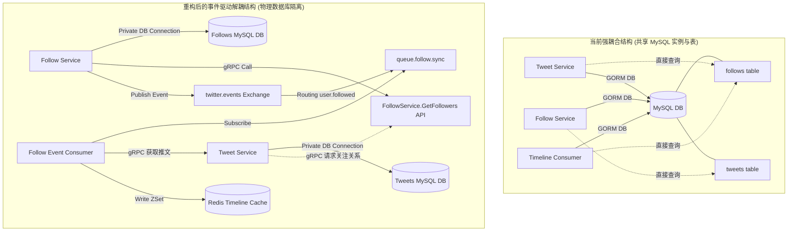

# Twitter Clone 事件驱动与服务解耦专题代码阅读计划

本阅读计划专为 **微服务解耦与事件驱动改造** 定制。在阅读本项目代码时，您的核心目标是**识别系统中的强耦合点（如共享数据库、内存混拼、非托管的异步协程）**，并理解项目现有的事件体系（如 Canal CDC、Transactional Outbox、RabbitMQ 重试与死信队列机制），从而为接下来的事件驱动重构打下坚实的基础。

---

## 🗺️ 代码结构快速总览

在开始阅读前，请先熟悉项目的 Monorepo 结构：

- **[cmd/](file:///e:/GOProject/cloud/twitter-clone/cmd)**: 存放所有服务的启动入口（包括 Gateway、6个核心微服务、Canal Relay 中继器以及 Timeline 消费者）。
- **[internal/domain/](file:///e:/GOProject/cloud/twitter-clone/internal/domain)**: 统一的领域实体定义（如 `User`, `Tweet`, `Follow`, `OutboxTask` 等）。
- **[internal/module/](file:///e:/GOProject/cloud/twitter-clone/internal/module)**: 存放各个微服务的核心业务逻辑，采用 Clean Architecture 结构（`grpc` 暴露接口，`service` 处理业务，`repository` 处理 DB，`cache` 处理 Redis 缓存）。
- **[internal/mq/](file:///e:/GOProject/cloud/twitter-clone/internal/mq)**: 存放消息队列相关的生产者（`producer`）和消费者（`consumer`）的具体业务处理。
- **[internal/infrastructure/](file:///e:/GOProject/cloud/twitter-clone/internal/infrastructure)**: 数据库连接、Redis 缓存基础设施、RabbitMQ 通道声明。

---

## 📅 10天专题阅读计划日程表

### 🛑 第一阶段：契约定义与伪微服务共享数据库缺陷分析 (Day 1 - Day 2)
> **目标**：理清各微服务的服务契约，并重点分析为什么当前的微服务是“伪微服务”（即共享物理数据库和模型表结构的技术债）。

- **🗓️ Day 1: gRPC 契约与领域实体**
  - **核心阅读文件**：
    - `api/` 目录下的所有 `.proto` 协议文件，重点查看 `follow.proto` 和 `tweet.proto`。
    - [internal/domain/](file:///e:/GOProject/cloud/twitter-clone/internal/domain) 目录下的实体模型，重点关注 [follow.go](file:///e:/GOProject/cloud/twitter-clone/internal/domain/follow.go) 和 [tweet.go](file:///e:/GOProject/cloud/twitter-clone/internal/domain/tweet.go)。
  - **思考题**：各微服务之间是如何通过 gRPC 进行数据交互的？在模型设计上，`Tweet` 与 `Follow` 实体是如何关联的？

- **🗓️ Day 2: 数据库 AutoMigrate 与 schema 拥有权混乱审计**
  - **核心阅读文件**：
    - [cmd/follow-service/main.go](file:///e:/GOProject/cloud/twitter-clone/cmd/follow-service/main.go#L67-L72) （查看 `AutoMigrate` 传入的实体）
    - [cmd/tweet-service/main.go](file:///e:/GOProject/cloud/twitter-clone/cmd/tweet-service/main.go#L94-L99) （查看 `AutoMigrate` 传入的实体）
    - [cmd/consumer/main.go](file:///e:/GOProject/cloud/twitter-clone/cmd/consumer/main.go#L47-L59) （查看其数据库迁移代码）
  - **解耦焦点**：分析为什么 `follow-service` 在启动时会去迁移 `domain.Tweet{}`，为什么 `tweet-service` 在启动时会去迁移 `domain.Follow{}`？这违反了微服务数据库边界私有原则（Database-per-service）吗？

---

### 🛑 第二阶段：核心微服务强耦合逻辑溯源 (Day 3 - Day 4)
> **目标**：深入源码，寻找当前业务流程中以“同步调用”或“非托管后台协程（raw goroutines）”实现的强关联逻辑。

- **🗓️ Day 3: Follow Service 的“虚假异步”协程耦合**
  - **核心阅读文件**：
    - [follow_service_mq.go](file:///e:/GOProject/cloud/twitter-clone/internal/module/follow/service/follow_service_mq.go#L60-L171) (重点看 `Follow` 和 `Unfollow` 的具体实现)
  - **解耦焦点**：
    1. 在 `Follow` 成功后，代码通过 `go s.pullRecentTweetsToTimeline(...)` 和 `go s.handleFollowCelebrityStatus(...)` 启动了两个 raw goroutine。
    2. 如果 `follow-service` 意外宕机/重启，这两个未托管的异步操作会直接丢失，导致 Redis Timeline 缓存或大V状态出现永久不一致。
    3. `follow-service` 的 Service 结构体内直接持有了 `tweetRepo` (推文数据库仓储) 和 `timelineCache` (Redis 缓存)，形成了强耦合。

- **🗓️ Day 4: Tweet Service 的同步回源拉取耦合**
  - **核心阅读文件**：
    - [tweet_service_mq.go](file:///e:/GOProject/cloud/twitter-clone/internal/module/tweet/service/tweet_service_mq.go#L806-L842) (`getFeedsByPull` 降级逻辑)
  - **解耦焦点**：
    1. 当 Redis 的 Feed 流失效回源时，`TweetService` 直接调用了 `s.followRepo.GetFollowees(...)`，这意味着 `tweet-service` 直接读取了属于 `follow-service` 的底层 `follows` 数据库表。
    2. 如果后续我们将每个服务拆分为独立的物理数据库，此处的直接 DB 访问会导致编译/运行时失败。
    3. `cmd/consumer/main.go` 中，消费端也直接依赖了 `followRepo`。

---

### 🛑 第三阶段：深入现有事件发布与 Canal CDC 机制 (Day 5 - Day 6)
> **目标**：理解系统目前是如何利用 CDC (Change Data Capture) 和 Transactional Outbox 机制实现发帖事务和最终一致性的。

- **🗓️ Day 5: 事务性发件箱 (Outbox) 与 Canal 中继器**
  - **核心阅读文件**：
    - [tweet_service_mq.go:CreateTweet](file:///e:/GOProject/cloud/twitter-clone/internal/module/tweet/service/tweet_service_mq.go#L89-L203) (查看本地事务与写入 `outbox_events` 表的过程)
    - [canal-relay/main.go](file:///e:/GOProject/cloud/twitter-clone/cmd/canal-relay/main.go) (Canal 进程启动流程)
    - [canal.go](file:///e:/GOProject/cloud/twitter-clone/internal/infrastructure/canal/canal.go) (Canal 监听器，提取 binlog 写入 MQ 过程)
  - **核心概念**：系统如何保证“发推”和“发推事件落库”在同一个 MySQL 本地事务内？Canal 又是如何解析 binlog 并无感投递消息到 RabbitMQ 的？

- **🗓️ Day 6: Timeline Consumer 的消息消费与健壮性设计**
  - **核心阅读文件**：
    - [timeline_consumer.go](file:///e:/GOProject/cloud/twitter-clone/internal/mq/consumer/timeline_consumer.go) (重点看 `NewTimelineConsumer` 声明的 Exchange、队列绑定及 `handleFailure` 退避重试)
  - **核心概念**：
    1. 观察 `handleFailure` 机制：如何通过 `retry.events.exchange` 的 TTL 以及 `x-dead-letter-exchange` 机制实现指数退避延迟重试，避免 RabbitMQ 的重试风暴？
    2. 观察 `executeESIndex`：当同步 ES/Qdrant 向量数据库超时时，它是如何通过 `outbox_tasks` 表进行对账重试的？

---

### 🛑 第四阶段：网关 BFF 聚合与 AI 智能体边界 (Day 7 - Day 8)
> **目标**：阅读边界层的代码，明确网关的职责泄漏情况以及 Agent 的交互逻辑。

- **🗓️ Day 7: Gateway 网关的 BFF 数据混拼**
  - **核心阅读文件**：
    - [tweet_handler.go](file:///e:/GOProject/cloud/twitter-clone/internal/gateway/handler/tweet_handler.go)
    - [bookmark_handler.go](file:///e:/GOProject/cloud/twitter-clone/internal/gateway/handler/bookmark_handler.go)
  - **思考题**：在 `tweet_handler.go` 里的 `GetUserTimeline` 中，网关在拿到下游数据后，是否进行了复杂的排序和内存拼装？这是否加重了网关 CPU 的负担？

- **🗓️ Day 8: Agent Service & MCP 智能体交互**
  - **核心阅读文件**：
    - [cmd/agent-service/main.go](file:///e:/GOProject/cloud/twitter-clone/cmd/agent-service/main.go)
    - `internal/module/agent/mcp/tools/` 下的工具定义，如 `create_tweet.go`
  - **安全与解耦焦点**：在 Agent 调用 `create_tweet` 时，`user_id` 是直接由 LLM 传入的。如果攻击者通过 Prompt 注入，是否可以伪造别人的 `user_id` 发帖？在解耦后，如何将鉴权上下文通过 Context 隐式传递给下游？

---

### 🛑 第五阶段：事件驱动解耦方案设计 (Day 9 - Day 10)
> **目标**：在读完所有代码后，输出您的事件驱动重构设计方案。

- **🗓️ Day 9: 绘制服务间的数据流拓扑与解耦流向图**
  - 尝试画出重构后的数据流向图，比如：
    - 关注操作：`follow-service` 数据库更新 -> 事务落库/直接发布 `user.followed` 事件 -> 结束。
    - 异步处理：`TimelineConsumer` 或专门的 `FollowEventConsumer` 监听到 `user.followed` -> gRPC 请求 `tweet-service` 获取推文 -> 批量写入 `timelineCache`。

- **🗓️ Day 10: 编写改造的契约设计与重构伪代码**
  - 为 `tweet-service` 引入 `FollowServiceClient` gRPC 连接。
  - 在 `tweet-service` 内部使用 gRPC 请求获取关注者，切断 GORM 直连 `follows` 库的耦合。

---

## 🛠️ 重构设计蓝图剖析

### 1. 拟解耦的“伪微服务”数据库共享



### 2. 拟改造的“虚假异步协程”事件化

把 `follow_service_mq.go` 中的 unmanaged background goroutines 转化为真正的事件消息分发：

```go
// 改造前：同步 DB + unmanaged background goroutines
func (s *FollowService) Follow(ctx context.Context, followerID, followeeID uint64) error {
    s.repo.Follow(ctx, followerID, followeeID)
    
    // 强耦合与宕机丢失风险：
    go s.handleFollowCelebrityStatus(context.Background(), followerID, followeeID)
    go s.pullRecentTweetsToTimeline(context.Background(), followerID, followeeID) 
    
    return nil
}

// 改造后：同步 DB + 事务事件落库 (Outbox Pattern)
func (s *FollowService) Follow(ctx context.Context, followerID, followeeID uint64) error {
    // 使用 Unit of Work 确保关注数据保存与事件发布（或 Outbox 任务创建）的原子性
    return s.uow.Do(ctx, func(txCtx context.Context) error {
        if err := s.repo.Follow(txCtx, followerID, followeeID); err != nil {
            return err
        }
        
        // 创建 OutboxEvent 或发布事件
        event := &events.UserFollowedEvent{FollowerID: followerID, FolloweeID: followeeID}
        return s.outboxEventRepo.Create(txCtx, &domain.OutboxEvent{
            EventType: "USER_FOLLOWED",
            Payload:   event.ToJSON(),
        })
    })
}
```

---

> [!TIP]
> **阅读建议**：
> 1. 可以结合项目的 [docs/learn/DAILY_LEARNING_PLAN.md](file:///e:/GOProject/cloud/twitter-clone/docs/learn/DAILY_LEARNING_PLAN.md) 一起对照阅读。
> 2. 阅读代码时，着重观察包含 `go` 关键字的多线程启动位置以及数据库连接 `db *gorm.DB` 的入参传递，这些往往是强耦合或不可观测的隐患点。
> 3. 您可以使用 `/goal` 调试指令随时与我交流具体的代码片段逻辑。
